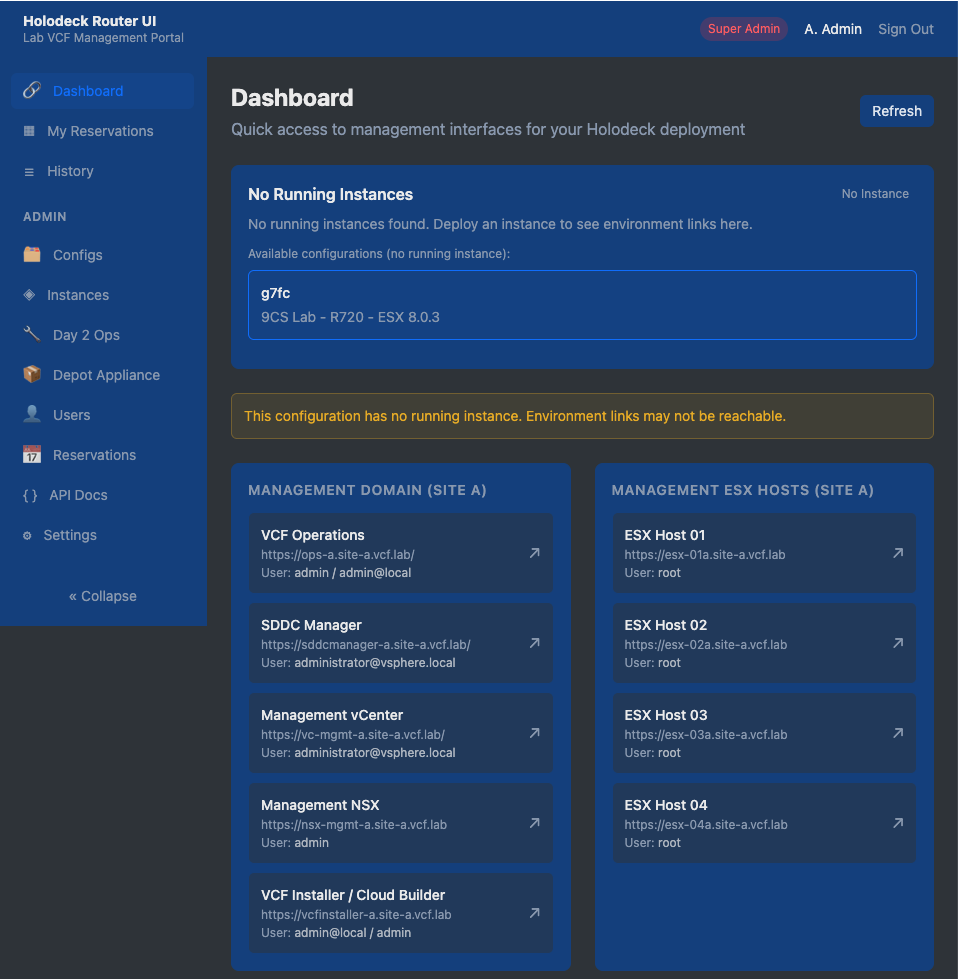
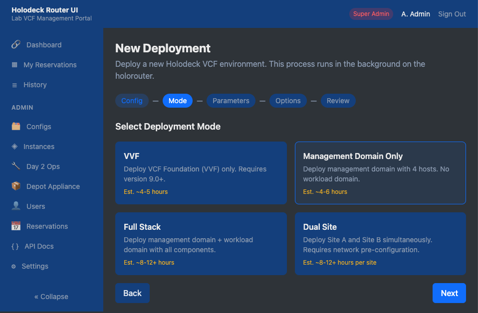
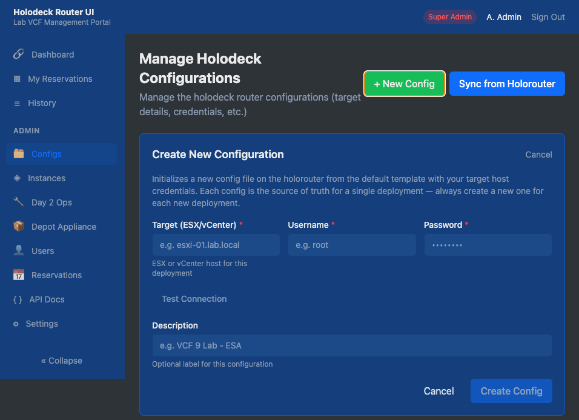
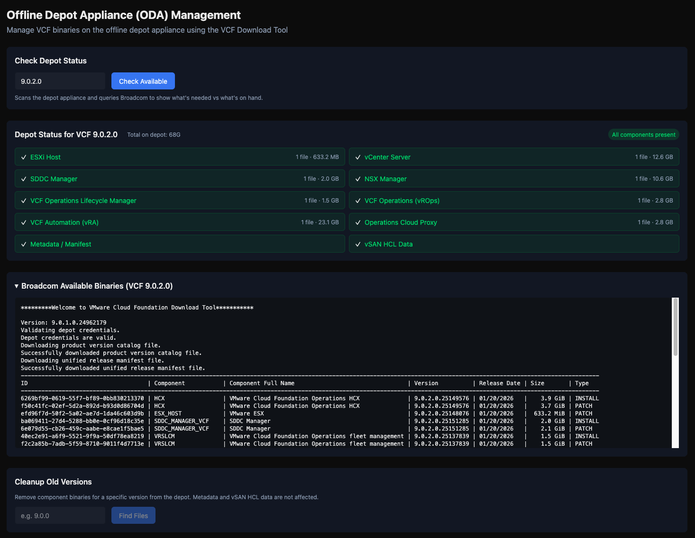

# Holodeck UI

Holodeck UI is a web-based frontend management interface for VMware VCF 9 Holodeck, supporting Holodeck 9.0 and 9.1. Provides a guided deployment wizard, Day 2 operations, PowerShell command execution, reservation scheduling, and user management — all driven through SSH to a holorouter VM.  The holorouter remains the "main source of truth" other than some caching of config files for loading commands faster and reducing ssh calls, no data is saved to the UI appliance.

This project is not associated with, endorsed by, or supported by Broadcom, VMware by Broadcom, or any of its other subsidiaries.

## Recent Updates

- **Holodeck 9.1 support** — `Import-HoloDeckConfig` now requires `-Site` in 9.1; every call site (deploy, Day 2 ops, config sync, command runner) was updated to pass it. The deploy wizard's version list is 9.0/9.1 only. The depot checklist's expected components were updated for 9.1's decomposed SDDC Manager microservices (identity broker, license server, salt, depot service, services runtime, SDDC/Fleet lifecycle in place of the old standalone VRSLCM).
- **Holodeck Infrastructure dashboard section** (labadmin+ only) — convenience links to 9.1's new HoloRouter infra services (HashiCorp Vault, Authentik SSO, Technitium DNS), plus optional ESX host / vCenter links you can configure in Settings → Infrastructure URLs.
- **Caddy is now optional** — both the production and dev Docker Compose files can publish the app directly over HTTP without a reverse proxy or TLS. See [Docker](#docker) below.
- **`dev` branch + floating `:dev` image** — pushes to `dev` build `ghcr.io/xzitony/holodeck-ui:dev` for testing in a lab before cutting a real version tag. See [Dev Branch](#dev-branch-pre-release-testing).

## Prerequisites

You need a running and configured Holorouter instance, and optionally and Offline Depot Appliance (ODA)
Details about the Holodeck can be found at: [VMware by Broadcom - Holodeck Documentation](https://vmware.github.io/Holodeck/)

## Tech Stack

- **Framework**: Next.js 16 (App Router, React 19)
- **Database**: SQLite via Prisma ORM
- **Auth**: JWT (httpOnly cookies), bcrypt password hashing
- **SSH**: `ssh2` library for holorouter communication
- **Background Jobs**: tmux sessions for long-running operations
- **Email**: SMTP or Resend API (configurable per environment)
- **Styling**: Tailwind CSS 4 with dark theme
- **API Docs**: Swagger UI (OpenAPI 3.0)
- **Deployment**: Docker, with an optional Caddy reverse proxy for TLS

## Features
- **User Dashboard** — Quick access to deployed components based on instance deployment state(s)
- **Reservation System** — Time slot booking with overlap warnings, maintenance windows, customer demo flags
- **Config Management** — Create, update, and track multiple configurations on the holorouter at once
- **Instance Management** — Multi-step form for launching VCF deployments (VVF, Management, Full Stack, Dual Site)
- **Day 2 Operations** — Add clusters, ESXi nodes, or VCF Automation to existing deployments
- **Live Output Monitoring** — Real-time background tmux with capture and auto-scroll for long running operations
- **Role-Based Access** — Three roles: `user`, `labadmin`, `superadmin` with granular permissions
- **Global Configuration** — Centralized SSH, ESXi, depot, and UI customization settings
- **Environment Links** — Dynamic link dashboard with capability-aware conditional visibility, plus a role-gated Holodeck Infrastructure section for 9.1's Vault/Authentik/DNS services and optional ESX host/vCenter links
- **Email Notifications** — Reservation confirmations, deployment alerts, and reminders via SMTP or Resend API
- **Audit Logging** — Full history of logins, commands, deployments, and reservations
- **Advanced Troubleshooting** — Execute raw PowerShell commands with parameter forms, SSE streaming output
- **API Documentation** — Built-in Swagger UI at `/dashboard/developer`

## Screenshots

| Dashboard | Deploy Wizard |
|:-:|:-:|
|  |  |

| Config Management | Depot Appliance |
|:-:|:-:|
|  |  |

## Quick Start

### Local Development

```bash
# Install dependencies
npm install

# Set up database
cp .env.example .env
npx prisma migrate dev
npx prisma db seed

# Start dev server
npm run dev
```

The app runs at `http://localhost:3000`. Default login:
- **Username**: `admin`
- **Password**: `HoloDeck!Admin1`

> **Note:** Change the default admin password after first login. You can manage users and passwords from the Admin panel once logged in.

### Docker

Basic deployment should be possible using:
```
docker pull ghcr.io/xzitony/holodeck-ui:latest
```

```bash
# Set required environment variables
export JWT_SECRET="your-secret-key-this-needs-to-be-32chars"
export DOMAIN="holodeck.example.com"  # or localhost for local testing

# Build and run
./build.sh

# Or manually:
docker compose up --build
```

The container runs behind a Caddy reverse proxy on ports 80/443.

### Production (Docker Compose, Portainer Stack, etc.)

A standalone `docker-compose.prod.yml` is provided for production deployments. It pulls a prebuilt image from GitHub Container Registry, and publishes the app **directly over HTTP on port 3000 by default** — no reverse proxy or TLS required:

```bash
# Download the production compose file
curl -O https://raw.githubusercontent.com/xzitony/holodeck-ui/main/docker-compose.prod.yml

# Set required env vars and deploy
export JWT_SECRET="your-secret-key"
docker compose -f docker-compose.prod.yml up -d
```

This file is also designed to be pasted directly into a **Portainer Stack** — just set the `JWT_SECRET` environment variable in the Portainer UI and deploy.

To front it with Caddy + a real domain + TLS instead, set both `DOMAIN` and `COMPOSE_PROFILES=caddy`:

```bash
export JWT_SECRET="your-secret-key"
export DOMAIN="holodeck.example.com"
export COMPOSE_PROFILES="caddy"
docker compose -f docker-compose.prod.yml up -d
```

The app's auth cookie automatically detects whether it's being served over HTTP or HTTPS (via `X-Forwarded-Proto` when behind Caddy) — no extra configuration needed either way.

### Dev Branch (Pre-Release Testing)

Pushes to the `dev` branch build a floating `ghcr.io/xzitony/holodeck-ui:dev` image via GitHub Actions, separate from tagged releases. `docker-compose.dev.yml` mirrors the production file but always runs Caddy-free, publishing directly over HTTP on a non-default port (`APP_PORT`, default `3001`) so it can run alongside a production stack on the same host:

```bash
curl -O https://raw.githubusercontent.com/xzitony/holodeck-ui/dev/docker-compose.dev.yml
export JWT_SECRET="your-secret-key"
docker compose -f docker-compose.dev.yml up -d
```

The footer of the app shows `dev` instead of `production` for images built off the `dev` branch, so it's obvious which channel you're running.

## Environment Variables

| Variable | Description | Default |
|----------|-------------|---------|
| `DATABASE_URL` | SQLite database path | `file:/app/data/holodeck.db` |
| `JWT_SECRET` | Secret key for JWT signing | (required) |
| `DOMAIN` | Domain for Caddy TLS (only used if the `caddy` profile is enabled) | `localhost` |
| `COMPOSE_PROFILES` | Set to `caddy` to enable the Caddy reverse proxy (prod compose only — dev compose never runs it) | unset (no Caddy, direct HTTP) |
| `APP_PORT` | Host port to publish on (`docker-compose.dev.yml` only) | `3001` |

SSH, deployment, and SMTP email settings are configured through the Global Config page in the UI, not environment variables.

## Project Structure

```
src/
  app/
    api/                  # API routes
      auth/               # Login, logout, session
      config/             # Global config, SSH status, build info
      commands/           # Command CRUD, execution (SSE), configs
      deployments/        # Deployment jobs (CRUD, output capture)
      day2/               # Day 2 operations
      holodeck-configs/   # Config sync, inventory, credentials
      reservations/       # Reservation CRUD, overlap detection
      instances/          # Running instance queries
      depot/              # Depot file browser
      environment-links/  # Environment link CRUD
      cron/               # Scheduled tasks (reservation reminders)
      users/              # User management
      audit/              # Audit log queries
    dashboard/            # UI pages
      deploy/             # Deployment wizard
      day2/               # Day 2 operations
      deployments/        # Job list + live output viewer
      commands/           # Command runner
      reservations/       # Reservation scheduler
      instances/          # Running instance overview
      depot/              # Depot file browser
      environment/        # Environment link dashboard
      history/            # Audit log viewer
      developer/          # Swagger API docs
      admin/              # Config, users, commands, reservations management
  lib/
    ssh.ts                # SSH connection, tmux management, env block builder
    auth.ts               # JWT verification, user extraction
    db.ts                 # Prisma client singleton
    email.ts              # Email notifications (SMTP / Resend)
    capabilities.ts       # Feature capability detection
    validators.ts         # Zod schemas, template resolution
    reservation-guard.ts  # Reservation access checks
  components/
    layout/               # Sidebar, header, build footer
    deployments/          # Active deployment banner
    reservations/         # Active reservation banner
    ui/                   # Shared UI components
  providers/              # Auth and UI context providers
  hooks/                  # useAuth, useReservation, useSSE hooks
prisma/
  schema.prisma           # Database schema
  migrations/             # Migration history
  seed.ts                 # Dev seed (TypeScript)
  seed.js                 # Production seed (JavaScript)
config/
  commands.json           # Default command definitions
  environment-links.json  # Environment link definitions
```

## Database Models

| Model | Purpose |
|-------|---------|
| `User` | Accounts with roles (user/labadmin/superadmin) |
| `GlobalConfig` | Key-value settings (SSH, ESXi, depot, UI) |
| `CommandDefinition` | PowerShell command templates with parameters |
| `Reservation` | Time slot bookings with maintenance/demo flags |
| `BackgroundJob` | Deployment and Day 2 operation tracking |
| `AuditLog` | Action history for all operations |

## Architecture

### SSH & Command Execution

All holorouter communication goes through `src/lib/ssh.ts`:
- **Short commands** use the `ssh2` library directly with a persistent connection
- **Long-running operations** (deployments, Day 2 ops) spawn a local tmux session that wraps an SSH command to the holorouter
- Output is captured by polling `tmux capture-pane` and served to the browser

### Role Hierarchy

| Role | Capabilities |
|------|-------------|
| `user` | View environment, run basic commands, create reservations |
| `labadmin` | Deploy, Day 2 ops, run all commands (requires active reservation) |
| `superadmin` | Full access, manage users/config/commands, bypass reservations |

### Reservation System

- Users book time slots; overlapping reservations trigger confirmation warnings
- Lab admins can flag reservations as **maintenance windows** (banner visible to all users)
- Users can flag reservations as **customer demos** (escalated warnings for lab admins)
- Lab admins must have an active reservation to deploy; superadmins bypass this

## Scripts

| Command | Description |
|---------|-------------|
| `npm run dev` | Start dev server with Turbopack |
| `npm run build` | Production build |
| `npm run start` | Start production server |
| `npm run db:migrate` | Run Prisma migrations |
| `npm run db:seed` | Seed the database |
| `npm run db:studio` | Open Prisma Studio |
| `./build.sh` | Docker build with git SHA and timestamp |

## Docker Details

The `Dockerfile` uses a multi-stage build:
1. **deps** — Install npm dependencies
2. **builder** — Build Next.js with Prisma generation
3. **runner** — Alpine production image with tmux, openssh-client, sshpass

The entrypoint runs Prisma migrations and seeds before starting the server. Data persists via a volume mount at `./data`.

## Contributing

Issues and pull requests are welcome. If you run into a problem or have a feature request, please [open an issue](https://github.com/xzitony/holodeck-ui/issues).

## License

[MIT](LICENSE)
